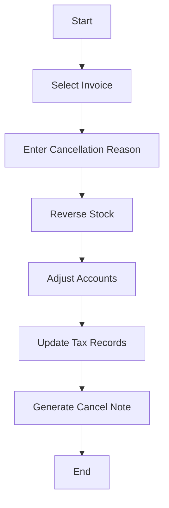

# ❌ Cancelled Sale

Invoices that were canceled post-creation, maintaining traceability.

---

## Key Features
- Audit trail
- Stock reversal
- Tax adjustments
- Payment refund tracking
- Document status updates

---

## Example Scenario
A customer places an order but later cancels it (or fails to pay by the due date). The business cancels the sale order and any related invoice, reversing all related entries so that no sale is recorded.

---

## Flow Diagram

