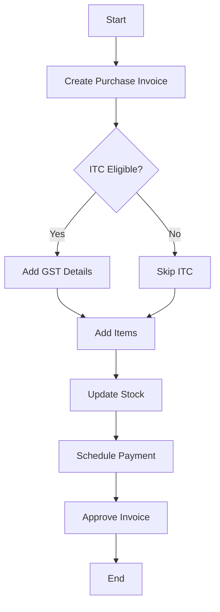

# 🧾 Purchase Invoice

Bills received from vendors for stock/services bought.

---

## Key Features
- ITC tracking
- Reverse charge handling
- Stock updates
- Payment scheduling
- Bill verification

---

## Example Scenario
A manufacturer orders raw materials from a vendor. When the materials arrive, the vendor sends a purchase invoice detailing items, quantities, and prices. This invoice records the company’s payable (liability) to the supplier.

---

## Flow Diagram

