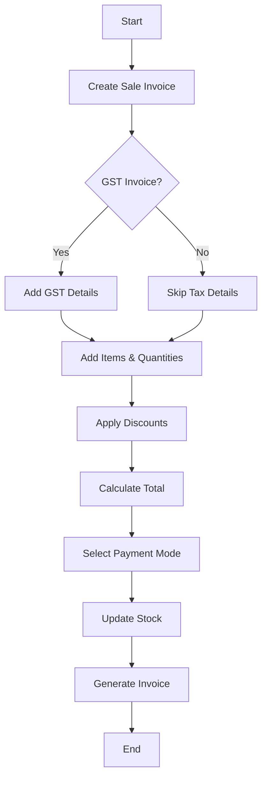

# 🧾 Sale Invoice

A final bill issued to a customer confirming the sale of goods/services with applicable taxes.

---

## Key Features
- Seller and Buyer Details
- Unique Invoice Number & Date
- Itemized Line Items
- Payment Terms
- Totals and Taxes
- Legal Record
- GST/Non-GST sale support
- Multi-mode payments
- Discounts and taxes breakdown
- Auto stock deduction
- Links with Delivery Challan and Sale Order

---

## Example Scenario
A retailer sells electronics to a customer on net-30 terms. After delivering the products, the retailer issues a sales invoice to the customer listing the items, quantities, prices, and payment due date. This invoice formally documents the sale and creates a legally binding payment request.

---

## Flow Diagram

