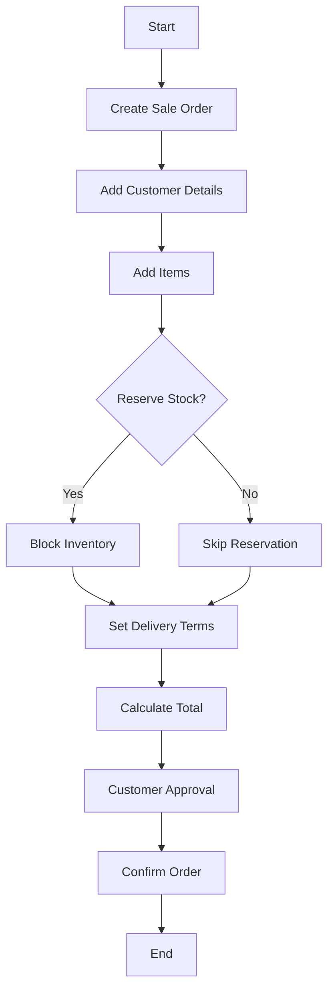

# 📦 Sale Order

A customer's confirmed order prior to invoicing. Acts as a commitment to deliver.

---

## Key Features
- Pre-invoice transaction
- Stock reservation (optional)
- Partial invoicing
- Custom delivery terms
- Quote to order conversion

---

## Example Scenario
An online customer places an order for furniture. The sales team creates a sales order specifying products, quantities, agreed prices, and expected delivery date. The sales order serves as a commitment and triggers inventory reservation and fulfillment planning.

---

## Flow Diagram

