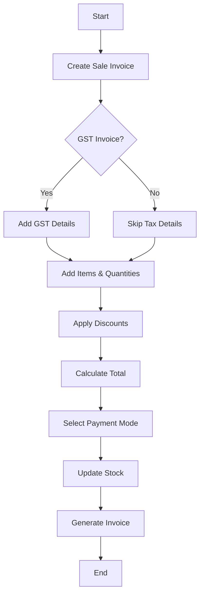
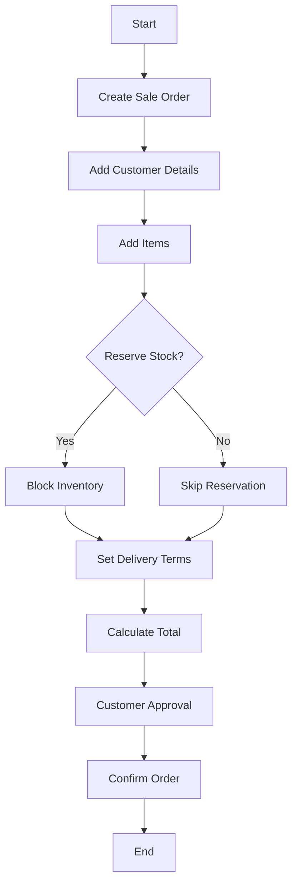
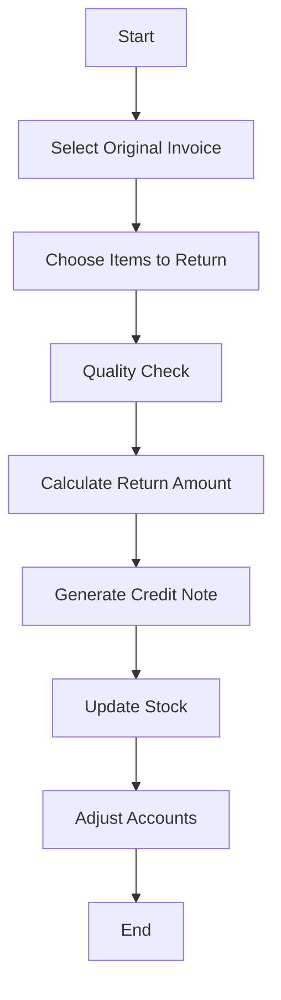
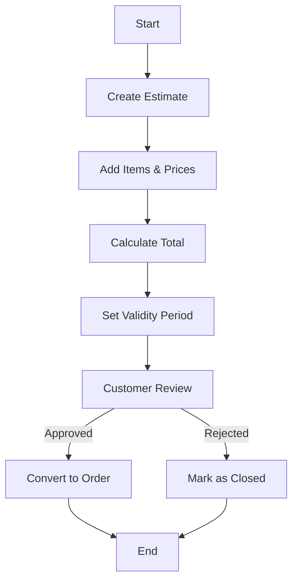
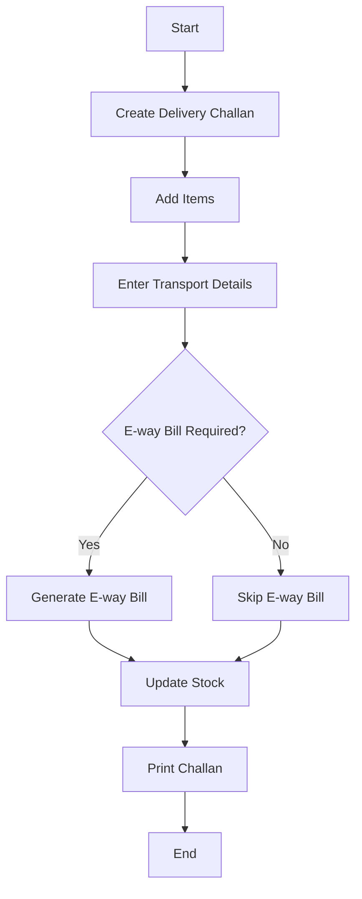
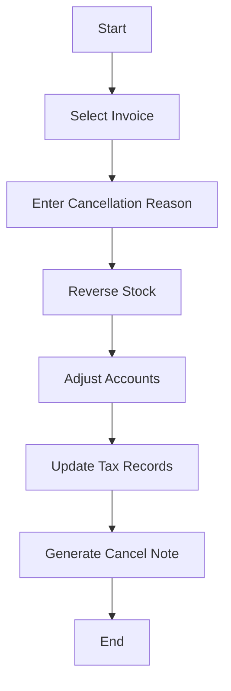
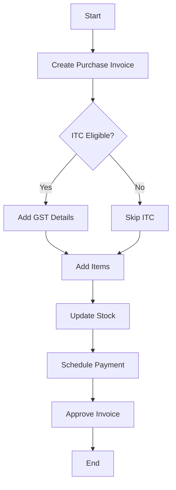
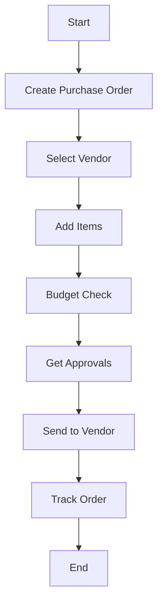
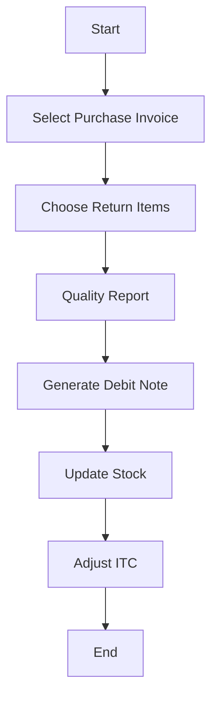
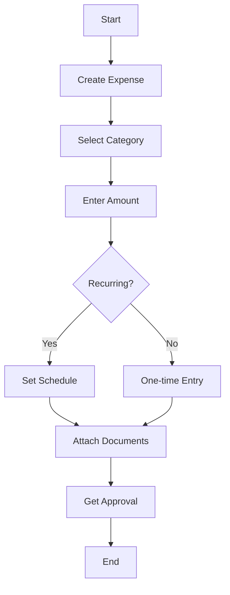

# 📄 Billing Software Functional Document

This document outlines the key transaction types supported in the billing software. It’s meant for developers and technical stakeholders to quickly refer to available functionalities, workflows, and differences across transaction modules.

---

## 1. 🧾 Sale Invoice

**Description:**
A final bill issued to a customer confirming the sale of goods/services with applicable taxes.

Example Scenario: A retailer sells electronics to a customer on net-30 terms. After delivering the products, the retailer issues a sales invoice to the customer listing the items, quantities, prices, and payment due date. This invoice formally documents the sale and creates a legally binding payment request

**Key Features:**
- Seller and Buyer Details: Includes names, addresses, and contact info of both parties (seller and customer)
- Unique Invoice Number & Date: Each invoice has a sequential ID and issue date for tracking
- Itemized Line Items: Lists each product/service with description, quantity, unit price, and subtotal
- Payment Terms: Specifies due date, payment methods, and any terms/discounts
- Totals and Taxes: Shows subtotal, applied taxes, discounts, and grand total amount due
- Legal Record: Acts as evidence of the sale and is recorded in accounts receivable.
- GST/Non-GST sale support: Handles both GST and non-GST transactions with appropriate tax calculations
- Multi-mode payments: Process payments through various methods including Cash, UPI, Card, and Bank Transfer
- Discounts and taxes breakdown: Detailed itemization of discounts and taxes at both line and invoice level
- Auto stock deduction: Automatically updates inventory levels upon invoice confirmation
- Links with Delivery Challan and Sale Order: Seamlessly converts related documents to invoices

**Flow Diagram:**

## 2. 📦 Sale Order

**Description:**
Customer's confirmed order prior to invoicing. Acts as a commitment to deliver.

Example Scenario:
An online customer places an order for furniture. The sales team creates a sales order that specifies the
products, quantities, agreed prices, and expected delivery date. The sales order serves as a commitment from the seller and triggers inventory reservation and fulfillment planning

**Key Features:**
- Pre-invoice transaction: Captures customer requirements before final billing
- Stock reservation: Optionally reserves inventory to ensure availability
- Partial invoicing: Allows creating multiple invoices against single order
- Custom delivery terms: Specify custom delivery dates and conditions
- Quote to order conversion: Easy conversion from quotations/estimates

**Flow Diagram:**

## 3. 🔄 Sale Return

**Description:**
When a customer returns goods post-sale. Adjusts both stock and accounts.

Example Scenario:
A customer returns a defective laptop within the return window. The business receives the item back, inspects
it, and issues a credit note or refund to the customer. A sales return reverses part or all of the original sale, adjusting revenue and inventory

**Key Features:**
- Original invoice linking: Direct connection to source sale invoice
- Stock adjustment: Automatically updates inventory levels on return
- Tax reversal: Handles GST/tax adjustments and credit notes
- Quality check integration: Records reason for return and item condition
- Return policy enforcement: Validates returns against configured policies

**Flow Diagram:**

## 4. 📋 Estimate

**Description:**
Non-binding quote shared before order/invoice confirmation.

Example Scenario:
A contractor is asked to quote the cost for a renovation project. The contractor prepares an estimate detailing the work scope, materials, and costs. This estimate is not a binding invoice but can be accepted by the customer later.
In accounting terms, an estimate is a non-posting transaction that can be converted to a sales order or invoice once approved

**Key Features:**
- No stock impact: Creates quotation without affecting inventory
- Validity period: Set specific timeframe for quote validity
- Multiple formats: Supports various template formats for different customers
- Easy conversion: One-click conversion to sale order or invoice
- Revision tracking: Maintains history of quote revisions

**Flow Diagram:**

## 5. 🚚 Delivery Challan

**Description:**
Non-monetary document issued during goods transportation.

Example Scenario: A
warehouse sends a bulk order to a retail store. A delivery challan is generated listing the items and
quantities dispatched. This document is especially used in jurisdictions (e.g., India under GST) to record
legal movement of goods even if no sale is finalized. It helps the customer confirm receipt and the company track stock transfers

**Key Features:**
- E-way bill integration: Generates and manages e-way bills automatically
- Stock tracking: Updates inventory when goods leave warehouse
- Multiple destinations: Supports multiple delivery locations in one challan
- Invoice conversion: Easy conversion to tax invoice later
- Transport details: Captures vehicle and transporter information

**Flow Diagram:**

## 6. ❌ Cancelled Sale

**Description:**
Invoices that were canceled post-creation, maintaining traceability.

Example Scenario: A customer places an
order but later cancels it (or fails to pay by the due date). The business then cancels the sale order and any
related invoice. Canceling a sale reverses all related entries so that no sale is recorded. For example, any
allocated inventory is returned to stock, and if payment was received, it is refunded. In legal terms, the sale is considered void and payment obligations are nullified

**Key Features:**
- Audit trail: Maintains complete history of cancellation with reasons
- Stock reversal: Automatically restores inventory levels
- Tax adjustments: Handles GST/tax reversals automatically
- Payment refund tracking: Manages refund process for paid invoices
- Document status: Updates all linked documents status

**Flow Diagram:**

## 7. 🧾 Purchase Invoice

**Description:**
Bills received from vendors for stock/services bought.

Example
Scenario: A manufacturer orders raw materials from a vendor. When the materials arrive, the vendor sends a
purchase invoice detailing items, quantities, and prices. This invoice records the company’s payable(liability) to the supplier. A purchase invoice lists what the buyer owes the seller

**Key Features:**
- ITC tracking: Manages input tax credit claims and reconciliation
- Reverse charge handling: Supports reverse charge mechanism entries
- Stock updates: Automatic inventory increment on bill confirmation
- Payment scheduling: Manages vendor payment terms and due dates
- Bill verification: Supports multi-level approval workflow

**Reverse Charge Mechanism (RCM) Explained:**
- **What is RCM?** Under GST, Reverse Charge means the recipient of goods/services is liable to pay GST instead of the supplier. This applies to notified goods/services or purchases from unregistered vendors.
- **When does it apply?** E.g., legal services, import of goods/services, or purchases from unregistered suppliers.
- **Accounting Impact:**
    - GST is paid by the buyer directly to the government.
    - Input Tax Credit (ITC) can be claimed only after payment of tax.
    - Special reporting and compliance required.
- **Workflow Impact:**
    - System should flag such invoices as RCM.
    - Payment and ITC claim tracked separately.
    - Additional validations for RCM applicability.

**Flow Diagram:**

## 8. 🛒 Purchase Order

**Description:**
A formal purchase request sent to vendors.

Example
Scenario: A retail business needs new inventory and creates a purchase order listing items, quantities,
agreed prices, and delivery date, then sends it to the vendor. The PO, once accepted by the vendor, forms a contract obligating the supplier to deliver the goods as specified. It initiates the purchase process

**Key Features:**
- Budget validation: Checks against allocated budget before approval
- Vendor rate comparison: Compares prices across multiple vendors
- Approval workflow: Supports multi-level authorization process
- Order tracking: Monitors order status and delivery progress
- Invoice matching: Validates incoming bills against PO terms

**Flow Diagram:**

## 9. 🔄 Purchase Return

**Description:**
Returning goods back to the supplier due to quality or excess

Example Scenario:
A bookstore receives a batch of books, but 10 copies are damaged. The bookstore returns these to the
supplier. A purchase return transaction notes the returned items and typically generates a credit note from the supplier. This reduces the company’s payable and adjusts inventory.

**Key Features:**
- Original bill linking: Maintains connection to source purchase invoice
- Quality documentation: Records detailed reason for return
- ITC reversal: Handles input tax credit reversals automatically
- Vendor communication: Generates return forms and communications
- Stock adjustment: Updates inventory levels on return confirmation

**Flow Diagram:**

## 10. 💸 Expense

**Description:**
Non-inventory costs such as travel, rent, software, etc.

Example
Scenario: An employee pays for business travel airfare and submits an expense report. The finance
department enters this as an expense in the system. Expenses can include utilities, travel, office supplies,
etc. Technically, an expense is a cost incurred to generate revenue
, and it is recorded immediately when
incurred (cash basis) or when liability arises (accrual basis).

**Key Features:**
- Category tracking: Organizes expenses by departments and categories
- Recurring setup: Automates regular expense entries
- Document attachment: Stores digital copies of expense bills
- Budget monitoring: Tracks expenses against allocated budgets
- Approval workflow: Routes expenses through approval hierarchy

**Flow Diagram:**

---

## 📊 Summary Table

| Transaction Type   | Affects Stock | Taxable | Convertible | Linked Docs        |
|--------------------|---------------|---------|-------------|--------------------|
| Sale Invoice       | ✅            | ✅      | ❌          | SO, DC             |
| Sale Order         | Optional      | ❌      | ✅          | Estimate           |
| Sale Return        | ✅            | ✅      | ❌          | Sale Invoice       |
| Estimate           | ❌            | ❌      | ✅          | ❌                 |
| Delivery Challan   | ✅            | ❌      | ✅          | Sale Order         |
| Cancelled Sale     | ✅            | ✅      | ❌          | Sale Invoice       |
| Purchase Invoice   | ✅            | ✅/❌   | ❌          | Purchase Order     |
| Purchase Order     | ❌            | ❌      | ✅          | ❌                 |
| Purchase Return    | ✅            | ✅      | ❌          | Purchase Invoice   |
| Expense            | ❌            | Optional| ❌          | ❌                 |

---

