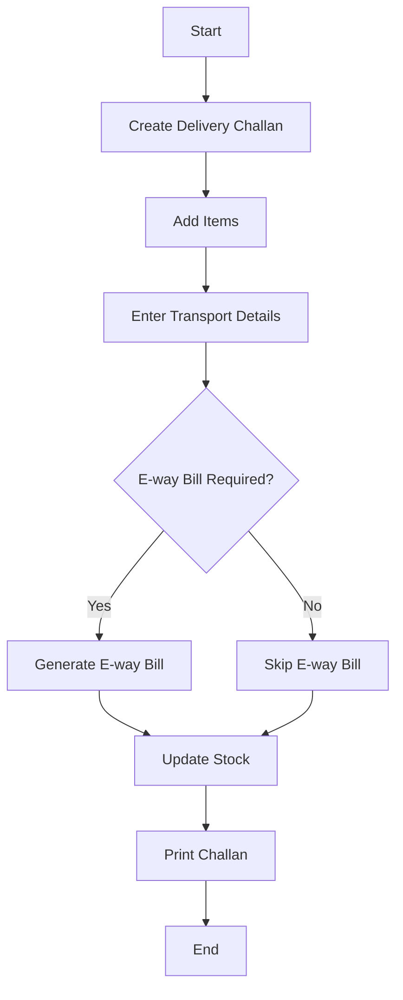

# 🚚 Delivery Challan

A non-monetary document issued during goods transportation.

---

## Key Features
- E-way bill integration
- Stock tracking
- Multiple destinations
- Invoice conversion
- Transport details

---

## Example Scenario
A warehouse sends a bulk order to a retail store. A delivery challan is generated listing the items and quantities dispatched. This document is used to record legal movement of goods even if no sale is finalized.

---

## Flow Diagram

