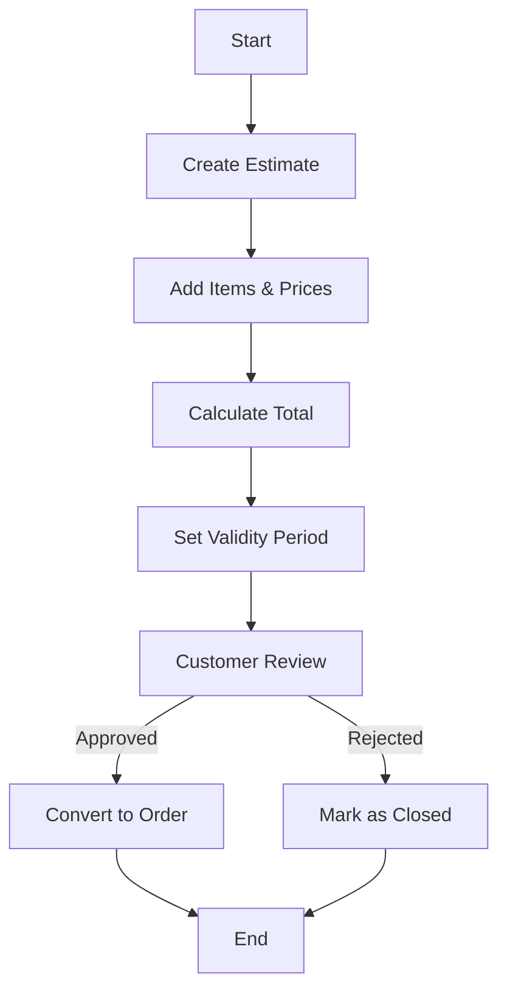

# 📋 Estimate

A non-binding quote shared before order/invoice confirmation.

---

## Key Features
- No stock impact
- Validity period
- Multiple formats
- Easy conversion to sale order or invoice
- Revision tracking

---

## Example Scenario
A contractor is asked to quote the cost for a renovation project. The contractor prepares an estimate detailing the work scope, materials, and costs. This estimate is not a binding invoice but can be accepted by the customer later.

---

## Flow Diagram

