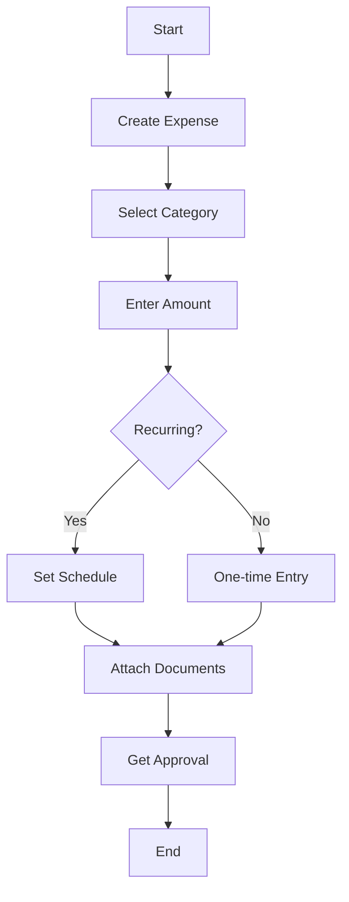

# 💸 Expense

Non-inventory costs such as travel, rent, software, etc.

---

## Key Features
- Category tracking
- Recurring setup
- Document attachment
- Budget monitoring
- Approval workflow

---

## Example Scenario
An employee pays for business travel airfare and submits an expense report. The finance department enters this as an expense in the system. Expenses can include utilities, travel, office supplies, etc.

---

## Flow Diagram

