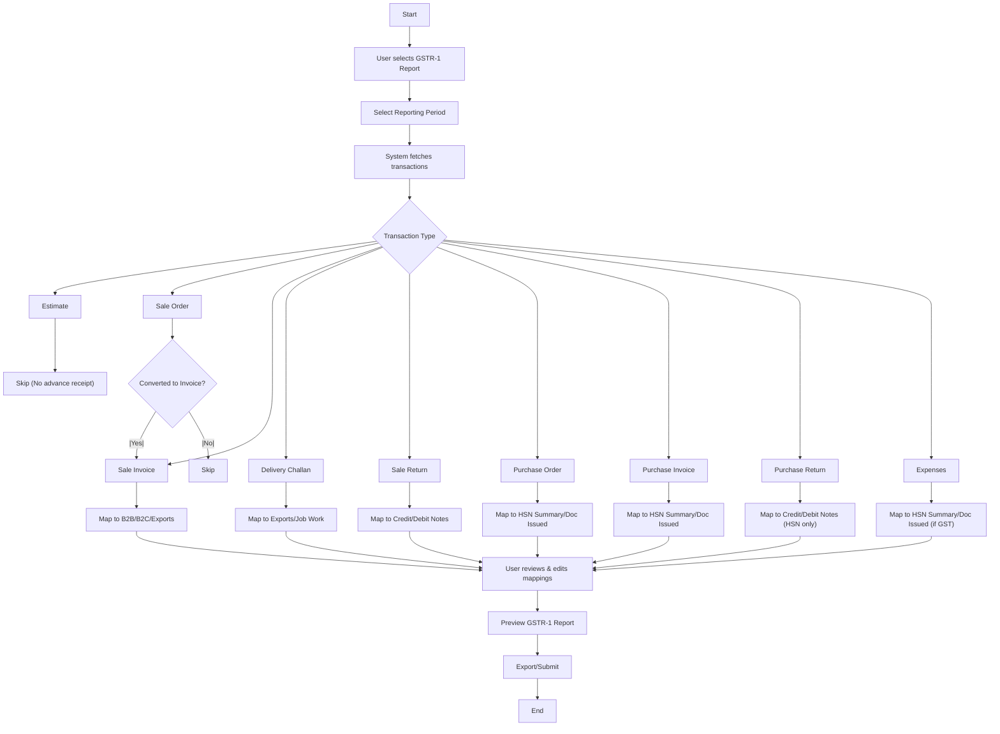

# GSTR‑1 Report: Your Ultimate Guide

[View GSTR-1 Cover PDF](./images/Form_GSTR-1.pdf)
[Download GSTR-1 Excel Sample](./samples/GSTR-1-Sample.xlsx)
[Download GSTR-1 JSON Sample](./samples/GSTR-1-Sample.json)

## What is GSTR‑1?

GSTR‑1 is a tax return that businesses must file to **report their outward supplies (sales)**.
If you’re a registered taxpayer, you need to provide details of taxable sales, exports, and supplies to SEZs, along with any *debit* or *credit* notes issued.

---

## Who Needs to File?

| Frequency | Threshold / Scheme | Due Date |
|-----------|--------------------|----------|
| **Monthly filers** | Annual turnover **> ₹5 crore** | 11th of the next month |
| **Quarterly filers** | QRMP scheme | 13th of the month following the quarter |

### Exemptions

* Composition‑scheme taxpayers
* Non‑resident foreign taxpayers
* TDS deductors
* E‑commerce operators
* Input‑service distributors

---

## What Data Goes Into GSTR‑1?

✅ **Invoices** – number, date, taxable value, CGST / SGST / IGST / Cess

✅ **HSN / SAC Codes**

* 4‑digit for AATO ≤ ₹5 crore
* 6‑digit for AATO > ₹5 crore

✅ **Automated tax calculation**

✅ **Predefined HSN dropdowns** – eliminates manual errors

✅ **Auto‑validation** – ensures compliance with GST rules

---

## Report Formats & Features

📊 **Formats:** Excel, PDF, JSON (for direct portal upload)
📂 **Data categorisation:** B2B, B2CL, Exempt & Export transactions
🔎 **Filters:**

* Date range
* Customer‑wise (GSTIN)
* HSN / SAC‑wise

📤 **Exports:** JSON, PDF and Excel for easy integration with accounting software.

---

## GSTR‑1 Report Breakdown

### 1️⃣  Basic Information

* GSTIN
* Business name
* Aggregate turnover (only in first GST year)

### 2️⃣  Sales & Transactions (Sections 4‑8)

| Section | Covers | Notes |
|---------|--------|-------|
| **4A, 4B, 4C** | Regular sales, RCM, e‑commerce | Standard invoices |
| **5A, 5B** | *Large* B2C (inter‑state > ₹2.5 L) | |
| **6A, 6B, 6C** | Zero‑rated & SEZ supplies | 6A exports, 6B/6C SEZ w/‑wo payment |
| **7A, 7B** | Unregistered B2C (< ₹2.5 L) | |
| **8A‑8D** | Nil‑rated / exempt / non‑GST | |

### 3️⃣  Adjustments & Corrections (Sections 9‑10)

* **Section 9** – Amendments for registered buyers (B2BA, CDNR)
* **Section 10** – Amendments for unregistered buyers (B2CLA, CDNUR)

### 4️⃣  Advances & Summary (Sections 11‑13)

* **11A / 11B** – Advance payments & adjustments
* **12** – HSN‑wise summary
* **13** – Document summary (invoices, CN/DN, cancellations)

---

## Why is GSTR‑1 Important?

✅ Mandatory for compliance – avoid penalties

✅ Auto‑populates GSTR‑2A & 3B – smoother ITC claims

✅ Efficient tax management – track taxable sales accurately

---

## Filters

* **Primary:** Invoice date range (date of supply)
* **Optional:** Entry‑creation date (capture late uploads)

---

## Sample Data Mapping Table

| Transaction type | GSTR‑1 section | Import condition | Notes |
|------------------|----------------|------------------|-------|
| Estimate | – | Not imported | No advance receipt |
| Sale order | B2B / B2C / Exports | *Only* if converted to invoice | If not converted → skip |
| Sale invoice | B2B / B2C / Exports | All | Composite / Non‑composite |
| Delivery challan | Exports / Job work | Supply without invoice | |
| Sale return | Credit / Debit notes | All | |
| Purchase order | HSN summary / Doc issued | All | **Inward** supply only |
| Purchase invoice | HSN summary / Doc issued | All | Inward supply only |
| Purchase return | Credit / Debit notes | All | HSN summary only |
| Expenses | HSN summary / Doc issued | GST applicable | |

---

## Handling Converted & Non‑Converted Sale Orders

* **Converted:** Included in outward supplies (sections 4‑8).
* **Non‑converted:** *Not* imported to GSTR‑1 – no taxable supply yet.

---

## Summary of Key Logic

* Estimates & sale orders: ignored unless converted.
* Purchase transactions: used only for HSN summary & doc summary.
* Composite vs non‑composite: mapping based on invoice details.
* Expenses: only GST‑impacting expenses included.

---

## GSTR‑1 Data‑Flow Diagram

---

## Output & Exports

| Format | Use case |
|--------|----------|
| **Excel** | Structured workbook (one sheet per section) |
| **PDF** | Printable, sign‑off friendly |
| **JSON** | GSTN schema upload |

*Triggers:* download locally or post JSON directly to GST portal API.
*Audit trail:* filenames can embed period + timestamp for traceability.

---

## Business Logic & Validation

* **Tax computation check:** sum of item‑level GST must equal invoice GST.
* **Composite supplies:** tax applied to principal HSN but all lines appear in HSN summary.
* **Data validation:** flag missing GSTIN, HSN, or value mismatches.
* **Reconciliation:** optional cross‑check Section 4 CGST total vs HSN summary CGST.

---

> **Tip:** Keep this Markdown in your repo’s `/docs` folder so both developers and functional users can PR review it.
> Images (e.g. cover, UI mocks) can be stored in a local `images/` directory and referenced relative to the `.md` file.
