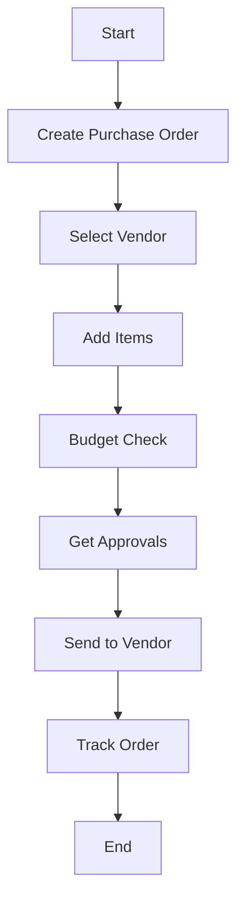

# 🛒 Purchase Order

A formal purchase request sent to vendors.

---

## Key Features
- Budget validation
- Vendor rate comparison
- Approval workflow
- Order tracking
- Invoice matching

---

## Example Scenario
A retail business needs new inventory and creates a purchase order listing items, quantities, agreed prices, and delivery date, then sends it to the vendor. The PO, once accepted, forms a contract obligating the supplier to deliver the goods as specified.

---

## Flow Diagram

