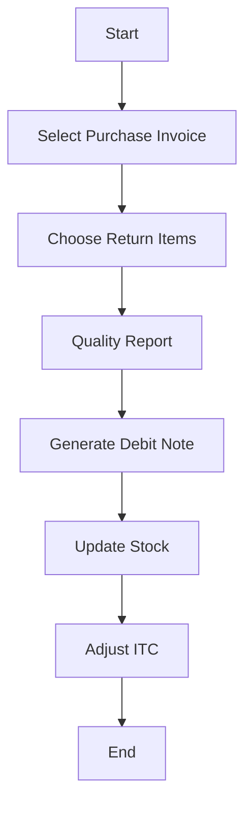

# 🔄 Purchase Return

Returning goods back to the supplier due to quality or excess.

---

## Key Features
- Original bill linking
- Quality documentation
- ITC reversal
- Vendor communication
- Stock adjustment

---

## Example Scenario
A bookstore receives a batch of books, but 10 copies are damaged. The bookstore returns these to the supplier. A purchase return transaction notes the returned items and typically generates a credit note from the supplier.

---

## Flow Diagram

