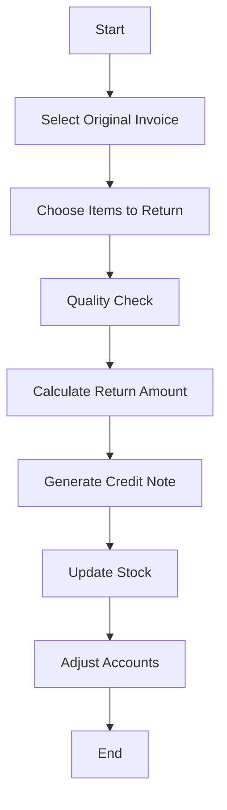

# 🔄 Sale Return

When a customer returns goods post-sale. Adjusts both stock and accounts.

---

## Key Features
- Original invoice linking
- Stock adjustment
- Tax reversal
- Quality check integration
- Return policy enforcement

---

## Example Scenario
A customer returns a defective laptop within the return window. The business receives the item back, inspects it, and issues a credit note or refund. A sales return reverses part or all of the original sale, adjusting revenue and inventory.

---

## Flow Diagram

